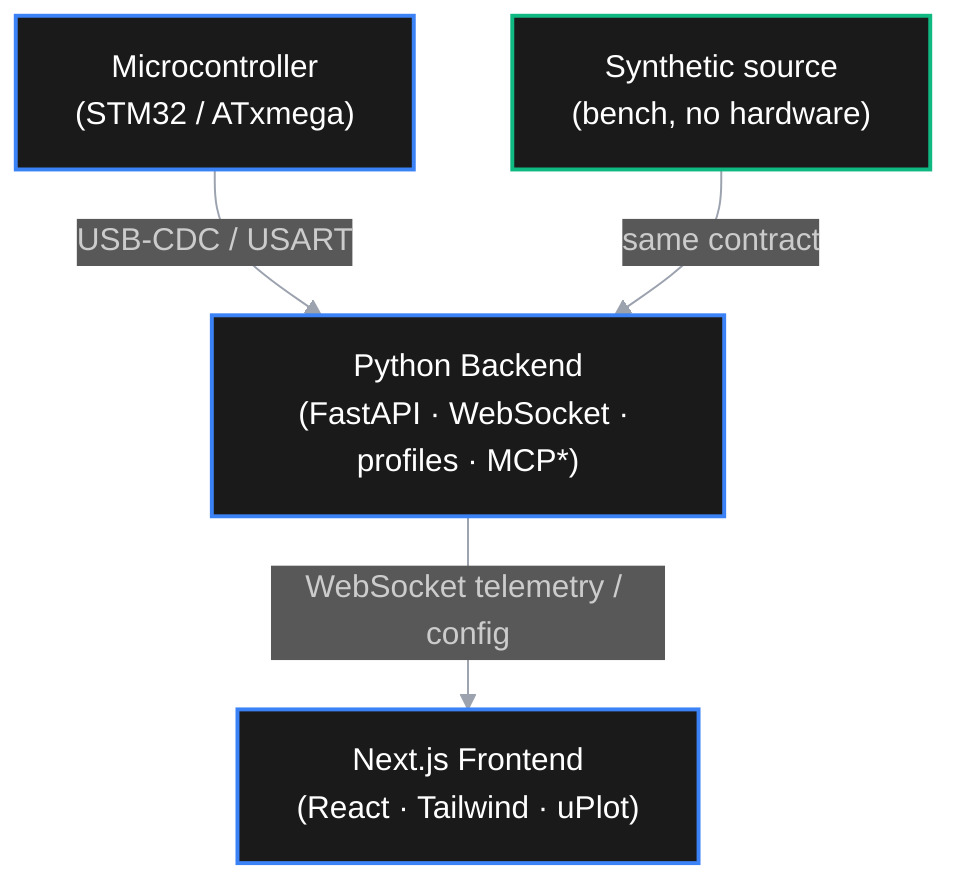

# Metal Detector Studio

A real-time signal diagnostics, analysis, and visualization suite for custom metal
detector development (VLF / Pulse Induction). It connects to the detector's
microcontroller over **USB-CDC / USART**, streams per-harmonic I/Q telemetry and raw
ADC blocks, and renders them as a vector hodograph, virtual oscilloscope, and live FFT
for ground-balance and discrimination tuning.

It is a **universal bench lab**: the detector under test is described by a JSON
**device profile**, so the same studio drives different firmwares without code changes.
And it runs **without hardware** — a built-in synthetic source reproduces the telemetry
contract so the whole pipeline works on the bench before an MCU is connected.


## Target devices (profiles)

- **Spectral-G4** — flagship multi-frequency VLF detector (STM32G474 base + STM32G071
  probe): 3 simultaneous harmonics via SHE-PWM (7.8125 / 23.4375 / 39.0625 kHz),
  per-harmonic `{mag, phase}` + phase diffs (`dphase31`, `dphase51`) and raw I/Q.
- **URD-1 / TAKTYK** — single-frequency VLF on ATxmega (USB-CDC telemetry).

Adding a new detector means adding a profile (`backend/profiles/<id>.json`), not
rewriting the PC software.

## System Architecture



\* MCP server is planned (see Status).

## Features

- **Vector & Phase-Shift Analysis (XY hodograph):** live I/Q vector trail per harmonic
  for target discrimination and ground-balance alignment.
- **Virtual Oscilloscope:** real-time time-domain plot of the raw ADC receiver block.
- **Live FFT (Spectrum Analyzer):** environmental EMI monitoring to tune frequencies.
- **Dynamic, profile-driven mapping:** a device-agnostic JSON contract
  (`backend/schema.json` + `backend/profiles/*.json`) adapts the studio to different
  firmware without PC rewrites.
- **Bi-directional Control:** send configuration back to the device (gain, mode,
  frequency, …). Mirrored by the synthetic source for bench testing.
- **AI-Agent Ready (Anthropic MCP):** planned MCP server exposing live telemetry as
  tools for coding assistants.

## Status

Built end-to-end on synthetic data first; hardware transport slots in behind the same
contract.

| Area | State |
| --- | --- |
| Telemetry contract (`schema.json` + profiles) | ✅ |
| Backend: FastAPI + WebSocket + synthetic source + config | ✅ |
| Frontend: dashboard, XY hodograph, virtual oscilloscope | ✅ |
| Live FFT | 🚧 planned |
| Config panel (UI) | 🚧 planned |
| Serial transport (real USB-CDC) | 🚧 planned |
| MCP server | 🚧 planned |

Roadmap and task breakdown live in `TASKS.md`.

## Tech Stack

- **Frontend:** Next.js 16 (React 19), Tailwind CSS v4, [uPlot](https://github.com/leeoniya/uplot)
  for high-frequency time-series rendering. Package manager: **pnpm**.
- **Backend:** Python ≥ 3.13 managed with [uv](https://docs.astral.sh/uv/), FastAPI,
  `websockets`, NumPy, `pyserial-asyncio` (for the upcoming serial transport).
- **Hardware compatibility:** any MCU streaming the telemetry contract over USART / USB-CDC.

## Project Structure

```text
├── assets/                # screenshots / media
├── backend/               # Python / FastAPI server + telemetry sources
│   ├── main.py            # entry point (uvicorn)
│   ├── schema.json        # device-agnostic packet grammar
│   ├── profiles/          # device profiles (spectral_g4.json, urd1.json, …)
│   ├── app/
│   │   ├── profiles.py    # profile + schema loader/validation
│   │   ├── config.py      # env-overridable settings
│   │   ├── telemetry/     # pydantic models (the contract in code)
│   │   ├── sources/       # synthetic source (+ serial, planned)
│   │   └── server/        # FastAPI app + WebSocket broadcast hub
│   └── scripts/ws_client.py  # WebSocket smoke-test client
└── frontend/              # Next.js app
    └── src/
        ├── app/           # dashboard page + layout
        ├── components/    # Hodograph, Scope (charts)
        └── lib/           # telemetry types + WebSocket hook
```

## Getting Started

### Prerequisites

- Python ≥ 3.13 and [uv](https://docs.astral.sh/uv/)
- Node.js ≥ 18 and [pnpm](https://pnpm.io/)
- (Optional) a detector MCU configured for USB-CDC telemetry — not required for bench work.

### 1. Backend

```bash
cd backend
uv sync
uv run python main.py
```

Serves on `http://127.0.0.1:8000`:

- REST: `/api/health`, `/api/schema`, `/api/profiles`, `/api/profile`
- WebSocket: `/ws/telemetry`

Environment overrides: `METAL_LAB_PROFILE` (e.g. `urd1`), `METAL_LAB_SOURCE`
(`synthetic` | `serial`), `METAL_LAB_HOST`, `METAL_LAB_PORT`.

### 2. Frontend

```bash
cd frontend
pnpm install
pnpm dev
```

Open the printed URL (default [http://localhost:3000](http://localhost:3000)) to view the
diagnostic suite.

## Telemetry contract

The PC ↔ firmware contract is self-describing:

- `backend/schema.json` — device-agnostic packet grammar (`hello`, `feature`, `raw`,
  `config`, `config_ack`).
- `backend/profiles/*.json` — concrete devices: harmonics, phase-diff definitions, raw
  ADC parameters, stream rates, and the synthetic-source model.

`feature` frames carry harmonics and phase diffs as keyed maps, so single- and
multi-frequency detectors share one packet shape.

## AI Integration (Model Context Protocol)

Planned: an MCP server exposing live telemetry as tools for AI models, so assistants can
read ADC/feature data, analyze phase shifts, and suggest firmware/DSP changes directly.
