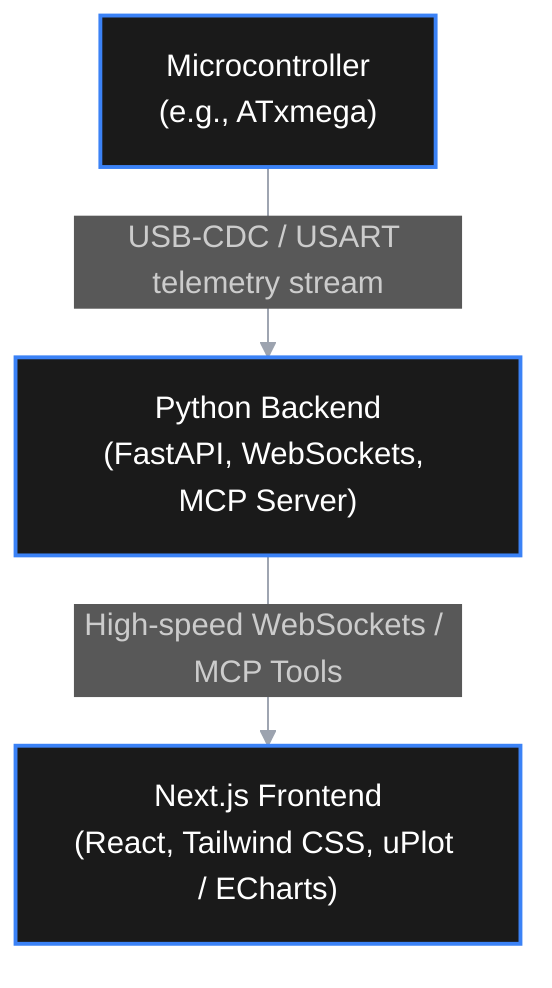

# Metal Detector Studio

A real-time signal diagnostics, analysis, and visualization suite designed for custom metal detector development (VLF / Pulse Induction). This tool connects directly to your microcontroller (such as ATxmega) via USB-CDC or USART to stream, analyze, and tune signals on the fly.

It is designed to run locally, providing high-performance telemetry visualization and deep integration with AI coding agents (like Claude, Codex) for smarter debugging.

## System Architecture



## Key Features

- **Vector & Phase-Shift Analysis (XY Plot):** Live vector trail (hodograph) showing In-Phase (I) and Quadrature (Q) components for accurate target discrimination and Ground Balance alignment.
- **Virtual Oscilloscope:** Real-time time-domain plotting of raw ADC receiver signals and digital filter outputs.
- **Live FFT (Spectrum Analyzer):** Monitor environmental electromagnetic interference (EMI) to tune operational frequencies.
- **Dynamic Data Mapping:** Universal JSON-based packet parsing, allowing easy adaptation to different microcontroller firmware versions without rewriting the PC software.
- **AI-Agent Ready (Anthropic MCP):** Built-in Model Context Protocol (MCP) server, allowing coding assistants like Claude in VS Code to query telemetry, analyze phase shifts, and write DSP code directly.
- **Bi-directional Control:** Send configuration commands back to the microcontroller to tweak filter coefficients, gain, or frequency in real-time.

## Tech Stack

- **Frontend:** Next.js (React), Tailwind CSS, shadcn/ui, `uPlot` / `Apache ECharts` (high-frequency rendering).
- **Backend:** Python 3.12+, FastAPI, `websockets`, `pyserial-asyncio`, `mcp` (Model Context Protocol).
- **Hardware Compatibility:** Any microcontroller with USART/USB capability sending structured telemetry packets.

## Project Structure

```text
├── backend/               # Python / FastAPI server & serial communication
│   ├── main.py            # Entry point (FastAPI & WebSocket server)
│   ├── mcp_server.py      # Anthropic MCP implementation for AI integration
│   └── schema.json        # Dynamic USART packet configuration
└── frontend/              # Next.js web application
    ├── components/        # Charts (uPlot/ECharts) and UI widgets
    └── pages/             # Main diagnostic dashboard
```

## Getting Started

### Prerequisites

- Python 3.12 or higher
- Node.js 18.x or higher
- A microcontroller (like ATxmega, STM32) configured for USB-CDC / Virtual COM Port telemetry.

### 1. Backend Setup

Navigate to the backend directory, install dependencies, and run the FastAPI server:

```bash
cd backend
pip install -r requirements.txt
python main.py
```

### 2. Frontend Setup

Navigate to the frontend directory, install npm packages, and run the Next.js development server:

```bash
cd ../frontend
npm install
npm run dev
```

Open [http://localhost:3000](http://localhost:3000) in your browser to view the diagnostic suite.

## AI Integration (Model Context Protocol)

This repository includes an MCP server that exposes the detector's telemetry as tools for AI models. When using VS Code extensions like **Cline** or **Roo Code**, you can configure the MCP settings to allow Claude to read live ADC data, analyze filter performance, and suggest firmware modifications directly.
