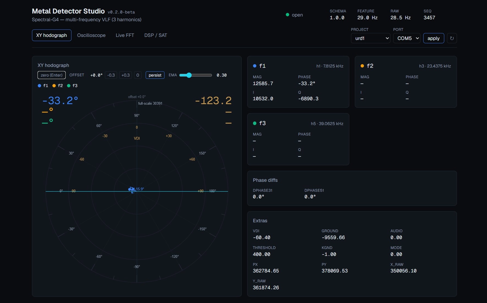
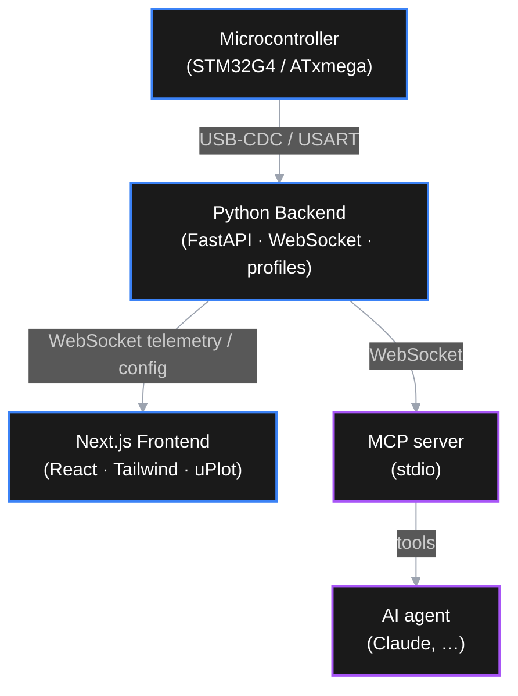

# Metal Detector Studio

A real-time signal diagnostics, analysis, and visualization suite for custom metal
detector development (VLF / Pulse Induction). It connects to the detector's
microcontroller over **USB-CDC / USART**, streams per-harmonic I/Q telemetry and raw
ADC blocks, and renders them as a vector hodograph, virtual oscilloscope, live FFT, and
a DSP/SAT analyzer for ground-balance and discrimination tuning.

It is a **universal bench lab**: the detector under test is described by a JSON
**device profile**, so the same studio drives different firmwares without code changes.



## Target devices (profiles)

- **Spectral-G4** — flagship multi-frequency VLF detector (STM32G474 base + STM32G071
  probe): 3 simultaneous harmonics via SHE-PWM (7.8125 / 23.4375 / 39.0625 kHz),
  per-harmonic `{mag, phase}` + phase diffs (`dphase31`, `dphase51`) and raw I/Q.
- **URD-1 / TAKTYK** — single-frequency VLF on ATxmega (USB-CDC telemetry).

Adding a new detector means adding a profile (`backend/profiles/<id>.json`), not
rewriting the PC software.

## System Architecture



## Features

- **Vector & Phase-Shift Analysis (XY hodograph):** live I/Q vector per harmonic on a signed
  ±180° protractor (0° at left), with a large smoothed phase readout and keyboard/one-click
  signal zero (recenters on the current vector). A **persistence / phosphor** mode leaves a
  fading trail where the vector tip has been (oscilloscope-style; dwelt-on phases stay
  brighter), an adjustable **EMA** control trades responsiveness for stability, and a visual
  **demodulator phase-offset** axis
  marks a re-tuned coordinate without altering the measured phase. A **VDI sub-scale** on the
  upper half maps phase 0 / 90 / 180° to −90 / 0 / +90, shown on the dial and as a large
  top-right readout mirroring the phase angle (top-left).
- **Virtual Oscilloscope:** real-time time-domain plot with timebase (50 ms–2 s),
  auto/manual vertical scale, and run/hold. A **sweep trigger** (auto / normal / single-shot,
  source I / Q / |IQ|, rising or falling edge, auto-placed or draggable level line) holds a
  stable waveform and captures one-shot target passes, alongside a fixed-position **measurements**
  overlay (Vpp, RMS, mean, frequency per I/Q). Shows the demodulated I/Q channels for devices that
  stream processed vectors (e.g. TAKTYK), or the raw ADC RX block where available.
- **Live FFT (Spectrum Analyzer):** Hann-windowed dBFS spectrum with selectable frequency
  span and a peak marker — environmental EMI monitoring to pick clean working bands.
- **DSP Analyzer:** a multi-channel strip-chart recorder — each signal on its own lane
  (per-channel auto, lock, or fixed scale): **audio** (the signal-strength indicator) with the
  **threshold** floor overlaid on the same 0..4000 scale, plus **ground** (post-correction
  baseline) — to watch the detection chain over time; plus a theoretical **filter lab**
  (EMA / band-pass impulse + frequency response, −3 dB estimate) mirroring the firmware DSP.
- **Dynamic, profile-driven mapping:** a device-agnostic JSON contract
  (`backend/schema.json` + `backend/profiles/*.json`) adapts the studio to different
  firmware without PC rewrites. Profile and serial port are switchable live from the
  header (no backend restart).
- **AI-Agent Ready (Anthropic MCP):** an MCP server exposes live telemetry as tools for
  coding assistants (read frames, analyze phase/spectrum, push config).

## Status

Talks to real detector hardware over USB-CDC; each device is described by a JSON profile.

| Area | State |
| --- | --- |
| Telemetry contract (`schema.json` + profiles) | ✅ |
| Backend: FastAPI + WebSocket + serial (USB-CDC) source | ✅ |
| Frontend: dashboard (hodograph · oscilloscope · FFT · DSP/SAT) | ✅ |
| Live profile/port switching from the UI | ✅ |
| MCP server (telemetry as AI tools) | ✅ |
| Serial transport (real USB-CDC) | ✅ (TAKTYK/URD-1 verified) |
| Config back to MCU over serial | 🚧 needs firmware command input |

Roadmap and task breakdown live in `TASKS.md`.

## Tech Stack

- **Frontend:** Next.js 16 (React 19), Tailwind CSS v4, [uPlot](https://github.com/leeoniya/uplot)
  for high-frequency time-series rendering. Package manager: **pnpm**.
- **Backend:** Python ≥ 3.13 managed with [uv](https://docs.astral.sh/uv/), FastAPI,
  `websockets`, NumPy, `pyserial-asyncio` (serial transport), `mcp` (MCP server).
- **Hardware compatibility:** any MCU streaming the telemetry contract over USART / USB-CDC.

## Project Structure

```text
├── assets/                # screenshots / media
├── backend/               # Python / FastAPI server + telemetry sources
│   ├── main.py            # entry point (uvicorn)
│   ├── mcp_server.py      # standalone stdio MCP server (telemetry as AI tools)
│   ├── schema.json        # device-agnostic packet grammar
│   ├── profiles/          # device profiles (spectral_g4.json, urd1.json, …)
│   ├── app/
│   │   ├── profiles.py    # profile + schema loader/validation
│   │   ├── config.py      # env-overridable settings
│   │   ├── telemetry/     # pydantic models (the contract in code)
│   │   ├── sources/       # serial (USB-CDC) source
│   │   └── server/        # FastAPI app + WebSocket broadcast hub
│   └── scripts/           # ws_client.py (smoke test), serial_sniff.py (port recon)
└── frontend/              # Next.js app
    └── src/
        ├── app/           # tabbed dashboard page + layout
        ├── components/    # Hodograph, IQScope/IQSpectrum (demod I/Q), Scope/Spectrum
        │                  #   (raw RX), Recorder + FilterLab (DSP/SAT), ControlPanel,
        │                  #   SourceControls
        └── lib/           # telemetry types, WebSocket hook, FFT, palette, REST client
```

## Getting Started

### Prerequisites

- Python ≥ 3.13 and [uv](https://docs.astral.sh/uv/)
- Node.js ≥ 20 and [pnpm](https://pnpm.io/)
- A detector MCU streaming USB-CDC telemetry (e.g. TAKTYK / URD-1).

### 1. Backend

```bash
cd backend
uv sync
uv run python main.py
```

Serves on `http://127.0.0.1:8000`:

- REST: `/api/health`, `/api/schema`, `/api/profiles`, `/api/profile`
- WebSocket: `/ws/telemetry`

Environment overrides: `METAL_LAB_PROFILE` (e.g. `urd1`), `METAL_LAB_SERIAL_PORT`
(e.g. `COM5`), `METAL_LAB_HOST`, `METAL_LAB_PORT`.

Point the backend at the device's virtual COM port (defaults to `COM5`):

```bash
METAL_LAB_PROFILE=urd1 METAL_LAB_SERIAL_PORT=COM5 uv run python main.py
```

The serial source parses the device's token-based ASCII telemetry (resyncing on the
record marker, tolerant of dropped line endings). To inspect an unknown device's output
first, use `uv run python scripts/serial_sniff.py COM5 115200`.

### 2. Frontend

```bash
cd frontend
pnpm install
pnpm dev
```

Open the printed URL (default [http://localhost:3000](http://localhost:3000)) to view the
diagnostic suite.

## Telemetry contract

The PC ↔ firmware contract is self-describing:

- `backend/schema.json` — device-agnostic packet grammar (`hello`, `feature`, `raw`,
  `config`, `config_ack`).
- `backend/profiles/*.json` — concrete devices: harmonics, phase-diff definitions, raw
  ADC parameters, and stream rates.

`feature` frames carry harmonics and phase diffs as keyed maps, so single- and
multi-frequency detectors share one packet shape.

## AI Integration (Model Context Protocol)

`backend/mcp_server.py` is a standalone **stdio MCP server** that connects to the running
backend as a WebSocket client and exposes live telemetry as tools for AI assistants:

- `get_status` — connection, active profile, stream rates
- `get_profile` — harmonics, phase-diff defs, raw spec, config keys, target list
- `get_latest_feature` — per-harmonic mag/phase(deg)/I/Q + phase diffs + extras
- `analyze_phase` — rank target archetypes by phase-diff distance (discrimination)
- `get_spectrum` — FFT peaks of the latest raw block (Hann window, dBFS)
- `set_config` — push config to the source (gain, mode, noise, target, …)

Start the backend (`uv run python main.py`), then register the server with your
MCP-capable assistant (example for Claude Code's `.mcp.json`):

```json
{
  "mcpServers": {
    "metal-detector-studio": {
      "command": "uv",
      "args": ["run", "python", "mcp_server.py"],
      "cwd": "backend"
    }
  }
}
```

Override the target backend with `METAL_LAB_WS` (default `ws://127.0.0.1:8000/ws/telemetry`).
